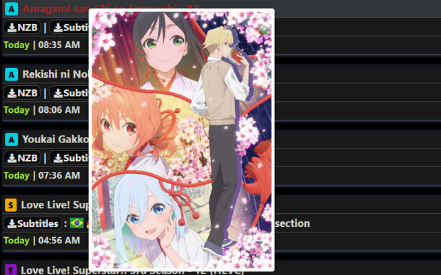

## Erai Hover Preview

**As of 22.12.24, Erai has introduced their own Poster on Hover feature, which can be enabled in the user settings. This makes this extension largely redundant.**

---

### Why You Might Still Use This Extension
- **Improved Positioning**: The hover preview is carefully positioned to avoid being cut off or going out of bounds, ensuring a consistent and user-friendly experience.
- **Customizable Scaling**: Define your own scaling for the hover previews, offering a level of customization not available in Erai's implementation.
- **Consideration**: Please note that this extension is slower compared to Erai's built-in feature because it loads the page behind the URL to fetch the specific div containing the poster.

---

### Description
This extension enhances your browsing experience by displaying hover preview images of anime posters.

Simply hover over links to anime lists, and a preview will appear.

